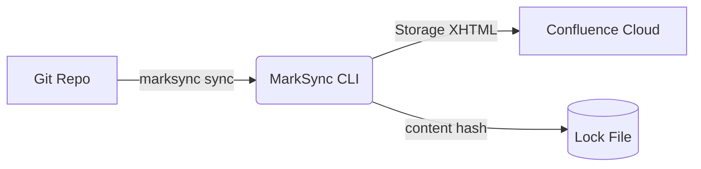

---
marksync:
  uuid: 019f5a2c-4a59-77aa-96ad-70f3719c2d1e
---

# Hello World from MarkSync

This page was published automatically by **MarkSync for Confluence** — a CLI tool that synchronizes Git-tracked Markdown
to Confluence Cloud.

## Why MarkSync?

- **Git as source of truth** — your docs live in Git, with full history and code review
- **Deterministic** — same input always produces the same Confluence output
- **Safe** — content-hash dedup, version-conflict detection, no silent overwrites
- **Auditable** — every page carries provenance (commit SHA, sync timestamp)

## Code Example

```typescript
function greet(name: string): string {
  return `Hello, ${name}!`;
}
```

## Team Status

| Member | Role      | Status   |
|--------|-----------|----------|
| Alice  | Tech Lead | Active   |
| Bob    | Engineer  | Active   |
| Carol  | Designer  | On leave |

## Architecture Diagram (Mermaid)



---

*This page is part of the MarkSync demo.*

## Update: Live Demo Section

This section was added **after the initial publish** to demonstrate the update flow.

### Key Metrics

| Metric             | Value         |
|--------------------|---------------|
| Pages synced       | 2             |
| Sync latency       | < 2s          |
| Content hash       | sha256-based  |
| Conflict detection | version-aware |

> **Note:** MarkSync detects unchanged content and skips unnecessary updates (NoOp).

## 🔄 Live Update

**Last synced:** 2026-07-13 08:58:25 CEST

This section is automatically updated by `demo.sh` to demonstrate the
marksync update flow. Each run produces a new page version on Confluence.

## Update Test 13:24:30

This line was added to test the update flow.

## Update Test 13:26:41

Testing the update flow after GH-62 fix.

## Update 16:42:33

Testing update flow with GH-62+GH-66 fixes.

## Updated Section (22:16:26)

This content was added to demonstrate the update flow.

## Live Update Section

**Updated:** This content was added to demonstrate the update flow.
MarkSync detects content changes and updates the Confluence page version.

## Manual update 2026-07-14

Let's see what happens now? :)

And let's add some code block:

```java
static invert(String s) {
    return new StringBuilder(s).reverse().toString();
}
```

## Testing tables

| Idea                    | Description                                                           |
|-------------------------|-----------------------------------------------------------------------|
| MarkSync                | A CLI tool that synchronizes Git-tracked Markdown to Confluence Cloud |
| MarkSync for Confluence | A CLI tool that synchronizes Git-tracked Markdown to Confluence Cloud |
