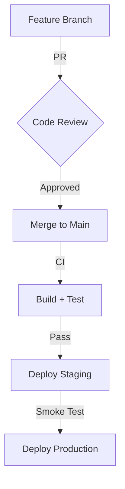

---
marksync:
  uuid: 019f5a2c-4a89-725f-aa59-9015713a0354
---

# Team Engineering Guide

A quick reference for engineering practices.

## Code Review Checklist

1. **Tests pass** — all CI checks green
2. **No secrets** — no tokens, keys, or credentials in code
3. **Docs updated** — README and inline docs reflect changes
4. **Breaking changes** — flagged in the PR description

## Deployment Flow

## Quick Links

- [Architecture Overview](https://example.com/architecture)
- [API Reference](https://example.com/api)
- [Coding Standards](https://example.com/standards)
